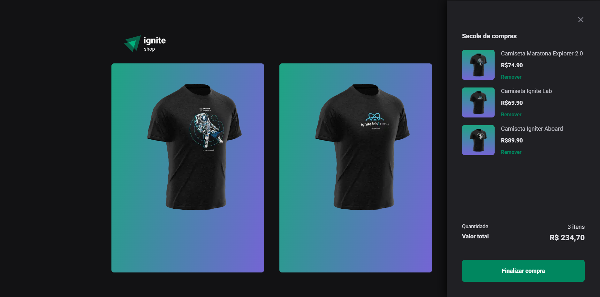

<h1 align="center">
  
</h1>

  <a href="#-technologies">Technologies</a>&nbsp;&nbsp;&nbsp;|&nbsp;&nbsp;&nbsp;
  <a href="#-project">Project</a>&nbsp;&nbsp;&nbsp;|&nbsp;&nbsp;&nbsp;
  <a href="#-layout">Layout</a>&nbsp;&nbsp;&nbsp;|&nbsp;&nbsp;&nbsp;
  <a href="#-how-to-run">How to run</a>&nbsp;&nbsp;&nbsp;|&nbsp;&nbsp;&nbsp;
  <a href="#-license">License</a>

  

 

 

  

## ✨ Technologies

This project was developed with the following technologies:

- [React](https://reactjs.org)
- [Next.js](https://nextjs.org)
- [Stitches](https://stitches.dev)
- [Stripe](https://stripe.com/en-br)
- [TypeScript](https://www.typescriptlang.org/)

## 💻 Project

The ignite shop is an ecommerce shirt by rocketseat

## 🔖 Layout

You can view the project layout through [from this link](https://www.figma.com/file/nlQe80XxBbcd8hkUHMWJqG/Ignite-Shop-2.0-(Copy)?t=uTtjIkbsl7s4QYfq-1). 
It is necessary to have an account [Figma](http://figma.com/) to access it.

## 🚀 How to run

- Clone the repository
- Install dependencies with `npm i`
- Start the server with `npm run dev`

You can now access [`localhost:3000`](http://localhost:3000) from your browser.

## 📄 License

This project is under the MIT license.

---

Made with ❤️ by Gustavo Oliveira 👋🏻